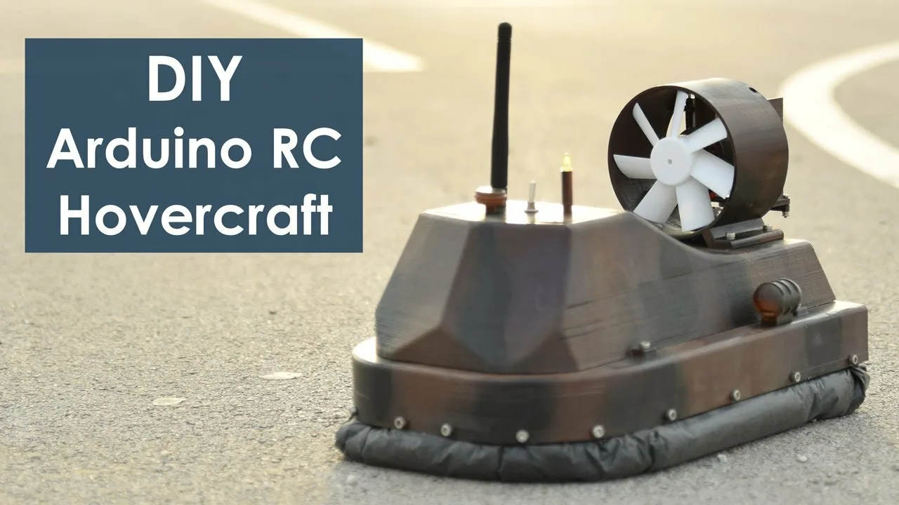
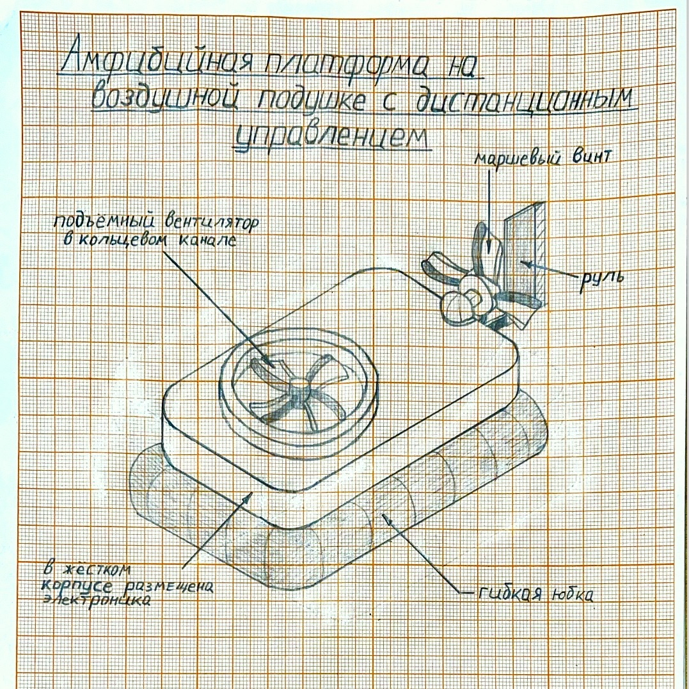

# Амфибийная платформа на воздушной подушке с дистанционным управлением

## 1. Менторы
- Азамат Георгиевич (от Б01-502, Б01-505)
- Евгений Игоревич (от Б01-505)
- Виктор Русанов (от Б01-507)

## 2. Команда
- Кокарев Константин, Б01-502, @Zinawe
- Хоменко Михаил, Б01-507, @s_m1sha
- Бессонов Захар, Б01-505, @zakharbessonoff

## 3. Цель проекта
Создать дистанционно управляемый аппарат на воздушной подушке (ховеркрафт), способный передвигаться по воде, льду и твёрдой поверхности за счёт статического воздушного слоя под юбкой корпуса, без контакта с поверхностью.

## 4. Описание функционала
- **Расчётная масса аппарата** (корпус + электроника + аккумулятор): 350–500 г.
- **Время автономной работы**: до 10–12 минут в режиме активного маневрирования.
- **Управление**: с пульта 2,4 ГГц (стандартный RC-приёмник или NRF24L01+, 3–4
канала: тяга, руль, газ подъёмного вентилятора).
- **Силоваяустановка**: раздельные каналы подъёма и тяги. Один двигатель нагнетает
воздух под юбку (подъём), второй создаёт маршевую тягу; поворот — рулём в струе
маршевого винта или дифференциальной тягой.
- **Амфибийность**: способность стартовать и двигаться как по воде, так и по ровной
твёрдой поверхности (асфальт, лёд, пол) без переналадки.
- **Габаритные размеры**: длина ∼350–400 мм, ширина ∼220–250 мм, высота юбки 
∼60–80 мм (размер юбки определяется из условия: избыточное давление в подушке,
необходимое для подъёма массы *m*, равно *p = m·g/S*; при *m* = 0,4 кг и *S* ≈ 0,06 м2
требуется *p* ≈ 65 Па — легко достижимо бытовым подъёмным вентилятором).

## 5. Задачи проекта
1. Расчёт требуемого давления и расхода воздуха в подушке под заданную массу аппарата, подбор подъёмного вентилятора/винта и диаметра юбки.
2. Выбор доступной элементной базы (моторы подъёма и тяги, драйверы/ESC, приёмник, аккумулятор, сервопривод руля).
3. Создание CAD-модели корпуса, канала подъёмного винта и крепления юбки.
4. Изготовление корпуса методом 3D-печати/раскроя пенопласта (EPP) и пошив/раскрой
юбки из ткани или плёнки.
5. Сборка электроники, настройка каналов управления, балансировка аппарата.
6. Тестирование на твёрдой поверхности и на воде: устойчивость, манёвренность, время
автономной работы.

## 6. Анализ существующих аналогов

### DIY-проект "Arduino RC Hovercraft"
- *Описание*: самодельный ховеркрафт на 3D-печатном корпусе с двумя бесколлекторными моторами (подъём и тяга), рулевыми сервоприводами и юбкой из
пакета/ткани, управление — Arduino и RC-передатчик.
- *Плюсы*: подробная документация, отработанная схема разделения подъёма и
тяги, открытые 3D-модели.
- *Минусы*: крупные габариты корпуса (рассчитан под большие 3D-принтеры),
Arduino Uno без встроенной радиосвязи, требует отдельного RF-модуля.

### Открытый проект arduino-hovercraft (3DJakob, GitHub)
- *Описание*: автономный/RC-управляемый ховеркрафт на Arduino с использованием готовых RC-компонентов.
- *Плюсы*: открытый код и конструкция, возможность перехода к автономному
режиму.
- *Минусы*: минимальная документация по расчёту подъёмной силы,ориентирован
на сушу, не тестировался на воде.

**Сравнение с разрабатываемым проектом**: наш проект ориентирован на компактный размер (длина ≤ 400 мм), явный расчёт подъёмной силы под целевую массу, раздельные малогабаритные двигатели подъёма и тяги и обязательную проверку амфибийности —
работу как на суше, так и на воде, что не является фокусом большинства любительских
аналогов.

## 7. Эскиз проекта и чертежи

***Принципиальная схема устройства***: плоский жёсткий корпус (пенопласт/3D-печать) с
гибкой юбкой по периметру, герметично закреплённой на нижней кромке корпуса. В верхней части корпуса установлен подъёмный вентилятор в кольцевом канале, нагнетающий
воздух вниз, под юбку — создаваемое избыточное давление приподнимает аппарат над поверхностью и устраняет трение о воду/грунт. В кормовой части закреплён маршевый винт
с рулём (подвижная пластина в воздушном потоке) для тяги и поворотов. Электроника
(контроллер, приёмник, аккумулятор) размещается в центре корпуса для балансировки
центра масс.